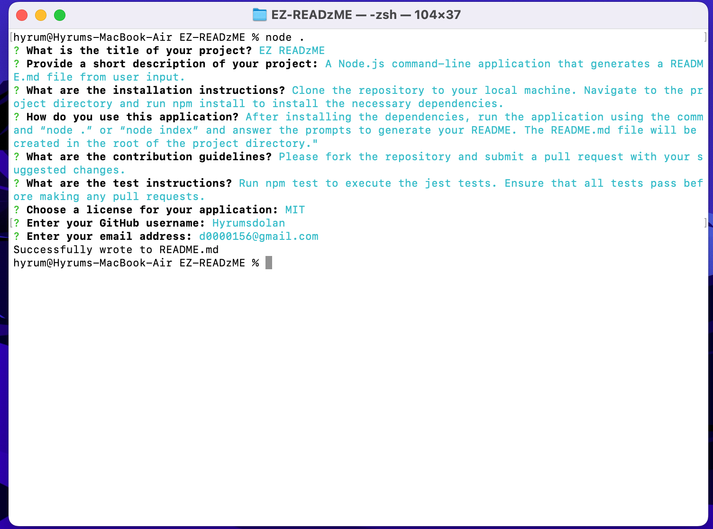

# EZ READzME

## Description
A Node.js command-line application that generates a README.md file from user input.

## Table of Contents
- [Installation](#installation)
- [Usage](#usage)
- [License](#license)
- [Contributing](#contributing)
- [Tests](#tests)
- [Questions](#questions)

## Installation
Clone the repository to your local machine. Navigate to the project directory and run npm install to install the necessary dependencies.

## Usage
After installing the dependencies, run the application using the command “node .” or “node index” and answer the prompts to generate your README. The README.md file will be created in the root of the project directory.

Click Picture Below for a Demo:

## License

This project is licensed under the MIT license. For more information, see the [license link](https://opensource.org/licenses/MIT).

## Contributing
Please fork the repository and submit a pull request with your suggested changes. 

## Tests
Run npm test to execute the jest tests. Ensure that all tests pass before making any pull requests.

## Questions
For any questions, please contact me using the information below:
- GitHub: [Hyrumsdolan](https://github.com/Hyrumsdolan)
- Email: d0000156@gmail.com
  